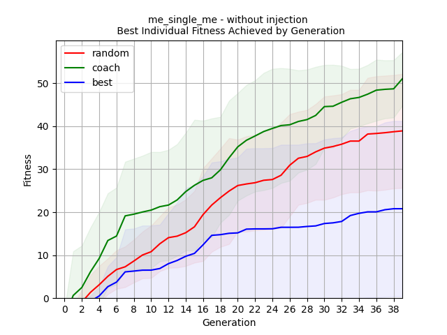
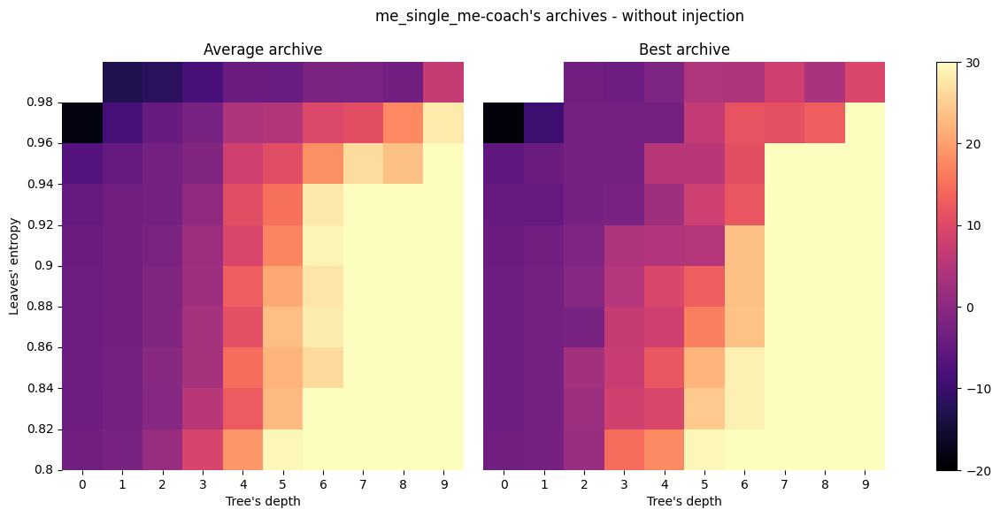
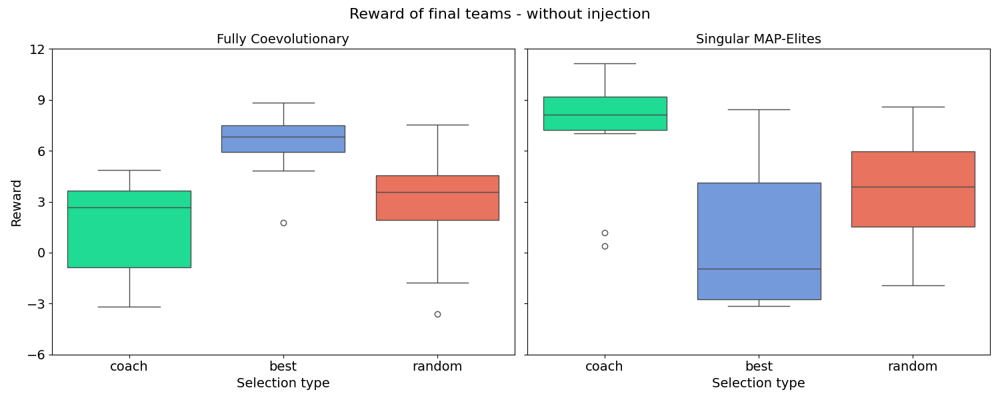

# Coach-Based Quality-Diversity for Multi-Agent Reinforcement Learning
The aim of the project is to develop a multi-agent reinforcement learning algorithm that uses quality diversity to create the sets of agents to solve a given multi agent task. The project is part of the master thesis developed by [Nielsen Erik](github.com/NielsenErik) at the University of Trento.
This repo contains the code and relevant sources used to developed the thesis project. 
The project is supervised by Giovanni Iacca and Andrea Ferigo from University of Trento and follows their current researches.

## Introduction
In [src](/src) are stored all the scripts developed during the project. The produced scripts and code are based on the following papers:
- [A Population-Based Approach for Multi-Agent Interpretable Reinforcement Learning](https://papers.ssrn.com/sol3/papers.cfm?abstract_id=4467882)
- [Quality Diversity Evolutionary Learning of Decision Trees](https://arxiv.org/abs/2208.12758)

## Installation
The project is developed in python 3.11. Here are the steps to install the project
```bash
git clone https://github.com/NielsenErik/MultiAgent_and_QualityDiversity_ReinforcementLearning
cd MultiAgent_and_QualityDiversity_ReinforcementLearning
pip install -r requirements.txt
```
### Note
1. The project is developed in python 3.11. It is recommended to use a virtual environment to install the project and its dependencies:
```bash
python3 -m venv pyenv-ma-qd
source pyenv-ma-qd/bin/activate
```
or
```bash
python3 -m venv pyenv-ma-qd
chmod +x script.sh
./script.sh
```

2. Magent2 is the test environment of the project. To install it, first is required to clone the project and then install the downloaded repository:
```bash
git clone https://github.com/Farama-Foundation/MAgent2
cd MAgent2
pip install -e .
```
This solution was proposed by [Issue #19](https://github.com/Farama-Foundation/MAgent2/issues/19) of the MAgent2 repository

## Running the project
To run the project, if the installation is done by creating a virtual environment, first is required to activate the virtual environment:
```bash
source venv/bin/activate
```
Then, to run the project, execute the following command:
```bash
chmod +x script.sh
./script.sh
```
The script will pop different running options, choose the desired option and the project will start running.

## Structure
The project is structured as follows:
1. [src](/src): Contains the source code of the project
    1. [agents](/src/agents): Contains the agents classes and algorithms used in the project
    2. [algorithm](/src/algorithm): Contains the algorithm regarding Map-Elites and Quality Diversity, developed using PyRibs, and the classes for Genetic Algorithm and Genetic Programming
    3. [config](/src/config): Contains the configuration files used in the project, such as the configuration of the environment, the algorithm, and the agents and most importantly the configuration of Map-Elites archive
    4. [decisiontrees](/src/decisiontrees): Contains the classes for create and manage the Decision Trees, RL-Decision Trees, Leaves and the Conditions on the Trees Nodes
    5. [utils](/src/utils): Contains the utility functions used in the project
    6. [marl_qd_launcher.py](/src/marl_qd_launcher.py): The main script to launch the project
    7. [experiment_launcher.py](/src/experiment_launcher.py): The script that contains experiments classes and types
    8. [test_team.py](/src/test_team.py): The script that runs the test of the teams generated during the training executions
    9. [eval_runs.py](/src/eval_runs.py): The script that generate all the plots and the data files over the training and test executions
2. [logs](/logs): Contains the logs files generated during the training and test executions of the project, as well as the results of the experiments and the final teams and agents generated
3. [hpc_scripts](/hpc_scripts): Contains the scripts used to run the project on the High-Performance Computing (HPC) cluster

## Results
All the results and executions of the project are stored in the [logs](/logs) folder. 
The results of out proposal are summerize in the following plots:

| Fitness trends during training | MAP-ELites heatmaps of our approach| Final teams reward comparison between approaches |
| ------------- | ------------- | ------------- |
|   |   |   |

## Papers and References
In [references](/references) there is a comprehensive list of references of the studied papers to complete the project.

## Source codes
In [src](/src) are stored all the scripts developed during the project. The produced scripts are based on the following papers by Giovanni Iacca, Marco Crespi, Andrea Ferigo, Leonardo Lucio Custode:
- [A Population-Based Approach for Multi-Agent Interpretable Reinforcement Learning](https://papers.ssrn.com/sol3/papers.cfm?abstract_id=4467882)
- [Quality Diversity Evolutionary Learning of Decision Trees](https://arxiv.org/abs/2208.12758)

## Citing
If you like this project, we would appreciate it if you starred the repository in order to help us increase its visibility. Furthermore, if you find the framework useful in your research, we would be grateful if you could cite our [publication](https://link.springer.com/chapter/10.1007/978-3-031-90062-4_25) using the following bibtex entry:
```bib
@inproceedings{nielsen2025coach,
  title={A Coach-Based Quality-Diversity Approach for Multi-agent Interpretable Reinforcement Learning},
  author={Nielsen, Erik and Ferigo, Andrea and Iacca, Giovanni},
  booktitle={International Conference on the Applications of Evolutionary Computation (Part of EvoStar)},
  pages={402--418},
  year={2025},
  organization={Springer}
}
```
